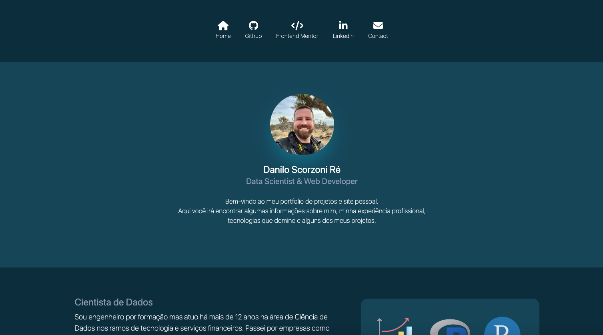

# Projeto de Site Pessoal em Tailwind

## Descrição

Este repositório contém código sobre um site pessoal feito em Tailwind. Isso é um projeto para por em prática alguns conhecimentos de Tailwind.

## Meu Processo

### Tecnologias utilizadas

-   HTML semântico
-   Tailwind

### Screenshots

Desktop

Mobile

### O que aprendi

Além dos recursos básicos do Tailwind, foi interessante aprender como construir layouts reponsivos utilizando os diferentes breakpoints. Desta forma também é possível ocultar algumas tags que não precisam ser mostradas na versão mobile (como por exemplo os nomes dos ícones do header).

## Links

-   Solução URL: [Github](https://github.com/dscorzoni/project-pessoal-tailwind)
-   Live Site URL: [Github Pages](https://dscorzoni.github.io/project-pessoal-tailwind)
